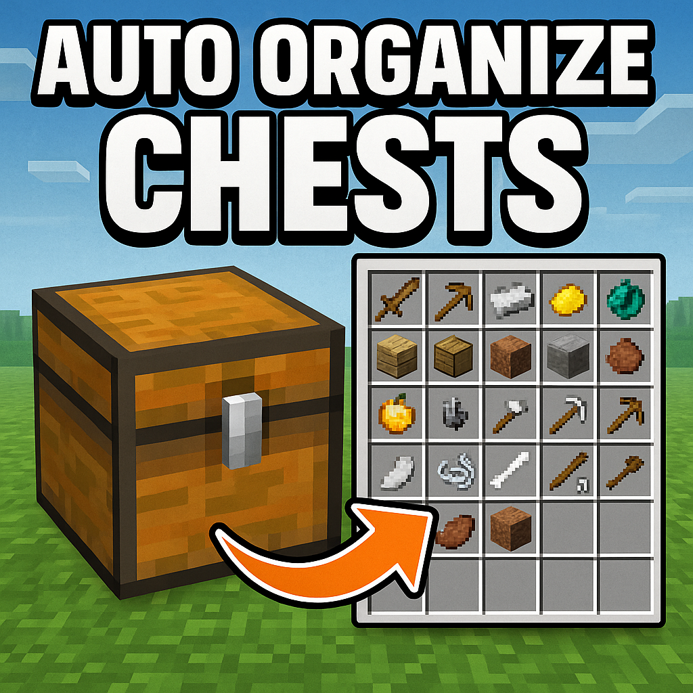

# Chest Organizer - Minecraft Bedrock Add-on

A Minecraft Bedrock add-on that automatically organizes chest contents when you close them, keeping your storage neat and tidy!



## Features

- **Automatic Organization**: Chests are automatically organized when you move away from them (closing them)
- **Smart Item Grouping**: Items of the same type are grouped together and sorted alphabetically
- **Stack Combining**: Partial stacks of the same item are automatically combined
- **Manual Organization**: Use chat commands to organize multiple chests at once
- **Lightweight**: Minimal performance impact on your world

## Requirements

- Minecraft Bedrock Edition 1.20.0 or higher
- World with "Beta APIs" experiments enabled
- Behavior Packs enabled in world settings

## Installation

### 1. Download the Add-on

Download the [`ChestOrganizer.mcaddon`](ChestOrganizer.mcaddon) file from this repository.

### 2. Install in Minecraft

1. Double-click the `.mcaddon` file (Minecraft will open automatically)
2. The add-on will be imported into the game
3. You'll see a confirmation message that the add-on was imported successfully

### 3. Activate in a World

#### For New Worlds

1. Create a new world
2. Go to "World Settings" > "Add-Ons"
3. Enable "Chest Organizer" in the "Behavior Packs" section
4. Make sure "Beta APIs" is enabled in "Experiments" if prompted
5. Create the world

#### For Existing Worlds

1. Select your world and click "Edit"
2. Go to "Settings" > "Add-Ons"
3. Enable "Chest Organizer" in the "Behavior Packs" section
4. Make sure "Beta APIs" is enabled in "Experiments" if prompted
5. Save and enter the world

## How It Works

### Automatic Organization

1. **Detection**: The add-on detects when you open a chest
2. **Monitoring**: It monitors your distance from the chest
3. **Organization**: When you move away from the chest (closing it), it automatically organizes the contents
4. **Sorting**: Items are grouped by type and sorted alphabetically
5. **Stack Combination**: Partial stacks of the same item are automatically combined

### Manual Organization Commands

You can also organize chests manually using chat commands:

- Type `!organize` in chat
- Type `!organizar` in chat (Portuguese support)

This will organize all chests within a 5-block radius of your current position.

### Organization Rules

1. **Item Grouping**: All items of the same type are placed together
2. **Alphabetical Sorting**: Items are sorted alphabetically by their type ID
3. **Stack Optimization**: Partial stacks are combined when possible
4. **Space Efficiency**: Items are placed in the most space-efficient way possible

## Supported Chest Types

- Regular Chests (`minecraft:chest`)
- Trapped Chests (`minecraft:trapped_chest`)

## Chat Messages

The add-on provides feedback through chat messages:

- `§a[Organizer] Chest organized automatically!` - When a chest is automatically organized
- `§a[Organizer] X chest(s) organized!` - When using manual organization command
- `§c[Organizer] No chests found nearby!` - When no chests are found near you during manual organization

## Technical Details

### How Detection Works

- The add-on tracks when players interact with chests
- It monitors the distance between the player and the chest every second (20 ticks)
- When the distance exceeds 6 blocks, it considers the chest "closed" and organizes it
- Invalid players are automatically cleaned up from the tracking system

### Performance Considerations

- The add-on runs a lightweight check every second
- Only tracks players who have recently opened chests
- Automatically cleans up data for players who leave the game
- Minimal impact on server performance

## Limitations

- **Experimental Features**: Requires "Beta APIs" to be enabled in world experiments
- **Version Requirement**: Only works with Minecraft Bedrock 1.20.0 or higher
- **Detection Delay**: There may be a small delay in detecting when a chest is closed
- **Range Limit**: Manual organization command works within a 5-block radius

## Troubleshooting

### Add-on Not Working

1. **Check Experiments**: Make sure "Beta APIs" is enabled in your world's experiments
2. **Check Version**: Ensure you're running Minecraft Bedrock 1.20.0 or higher
3. **Check Activation**: Verify the add-on is enabled in your world's behavior packs
4. **Restart World**: Try leaving and rejoining the world

### Chests Not Organizing

1. **Distance Check**: Make sure you're moving far enough away from the chest (more than 6 blocks)
2. **Chest Type**: Verify you're using regular chests or trapped chests
3. **Permissions**: Ensure you have permission to interact with chests in the world

### Manual Command Not Working

1. **Spelling**: Make sure you're typing `!organize` or `!organizar` correctly
2. **Proximity**: Ensure there are chests within 5 blocks of your position
3. **Chat Permissions**: Verify you have permission to use chat commands

## Development

This add-on is built using:

- Minecraft Bedrock Script API
- JavaScript ES6 modules
- Beta APIs for advanced functionality

### File Structure

```text
ChestOrganizer/
├── manifest.json          # Add-on manifest and metadata
├── pack_icon.png          # Add-on icon
├── scripts/
│   └── main.js           # Main script with organization logic
└── README.md             # This documentation
```

## Contributing

Feel free to submit issues, feature requests, or pull requests to improve this add-on!

## License

This project is open source. Feel free to use, modify, and distribute as needed.

---

**Enjoy your organized chests!** 📦✨
